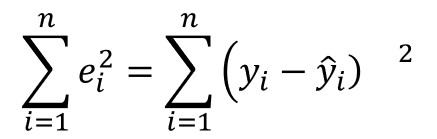

# Introducción a la IA con Python

completado: No

## Modulo 1

### **¿Qué es la regresión lineal?**

La regresión lineal es una técnica de análisis de datos que predice el valor de datos desconocidos mediante el uso de otro valor de datos relacionado y conocido. Modela matemáticamente la variable desconocida o dependiente y la variable conocida o independiente como una ecuación lineal.

